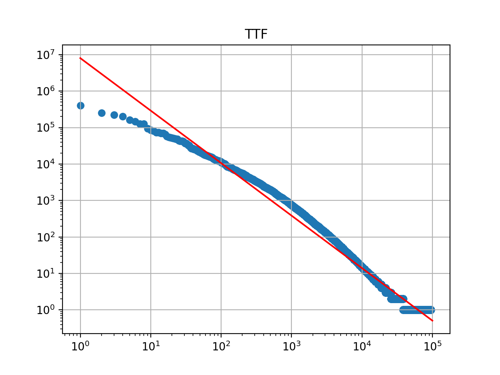

# Machine Problem 1

## Part I: Vector Space Model

### 1.1 Understand Zipf's Law

#### 1.1 - 1
Normalization implementation

```java
public String Normalization(String token) {
  // remove all non-word characters
  // please change this to removing all English punctuation

  // after tokenization, the actual punctuation should only appear in the either ends
  token = token.replaceAll("(^\\p{Punct}+|\\p{Punct}+$)", "");

  // convert to lower case
  token = token.toLowerCase();

  // add a line to recognize integers and doubles via regular expression

  // take care of formatted number with comma: 3,000.01
  Pattern numberPtn = Pattern.compile("\\d+(,\\d{3})*(\\.\\d+)?");
  Boolean isNumber = numberPtn.matcher(token).matches();

  // and convert the recognized integers and doubles to a special symbol "NUM"
  if (isNumber) {
    token = "NUM";
  }

  return token;
}
```

#### 1.1 - 2

The log-log scale plot of TTF



For the linear interpolation, the coefficient is `-1.43903409` and the intercept is `6.90280094`, which stands for `10^6.90280094` on y-axis.

#### 1.1 - 3

The log-log scale plot of DF


For the linear interpolation, the coefficient is `-1.41265775` and the intercept is `6.77386445`, which stands for `10^6.77386445` on y-axis.

TTF fits Zipf's law better than DF. The high-frequency words tend to occure multiple times in a long document. Document frequency makes these head works have exact the same weight with the words only appear once in a document. While the head words are heavily pubished, the tail words which rarely appear more than once in a document are not impacted. The above plots can also approve this. While both the linear interpolation can closely fit the center and tail parts of the dots, the head of DF has a much larger difference than TTF.

### 1.2 Construct a Controlled Vocabulary

#### 1.2 - 1

Restaurant specific stopwords

```
n't
good
food
NUM
great
and_the
order
of_the
it_was
time
this_place
wait
servic
back
it_s
in_the
friend
love
fri
on_the
and_i
the_food
delici
ve
sauc
restaur
i_was
do_n't
dish
eat
for_a
```

#### 1.2 - 2

The controlled vocabulary size is `3569`. The bigrams are removed if either of the tokens is a stopword.

#### 1.2 - 3

The IDF is caculated with log of base `e` and the total training documents is `38688`.

The top 50 N-grams


word | DF  |  IDF
-----|-----|-----------
tabl | 6758 | 2.744802486140284
make | 6529 | 2.779275682227886
menu | 6097 | 2.847732627506703
chees | 6066 | 2.8528300651659926
tast | 6042 | 2.856794391467902
chicago | 5826 | 2.893198815895139
amaz | 5798 | 2.898016443932918
thing | 5769 | 2.9030307191576297
nice | 5642 | 2.9252908618525773
peopl | 5454 | 2.9591801900089854
pretti | 5447 | 2.960464476030845
seat | 5396 | 2.969871536086873
night | 5298 | 2.9882000835825044
perfect | 4969 | 3.052310861812199
recommend | 4917 | 3.0628308860025797
drink | 4825 | 3.081718739641433
flavor | 4811 | 3.0846245117150657
price | 4660 | 3.1165140262948277
bar | 4658 | 3.116943302970233
meal | 4654 | 3.117802409552282
small | 4517 | 3.147681417759915
dinner | 4500 | 3.151452077656108
favorit | 4461 | 3.1601565182862545
bit | 4449 | 3.1628501226084773
worth | 4424 | 3.1684852102123484
made | 4210 | 3.218066826738092
enjoy | 4113 | 3.2413767851840953
side | 4101 | 3.24429862802246
experi | 4092 | 3.2464956263430023
chicken | 4072 | 3.2513951951841604
long | 4013 | 3.2659903831476025
pizza | 3980 | 3.2742476551360356
top | 3942 | 3.2838412657018536
fresh | 3942 | 3.2838412657018536
star | 3851 | 3.3071966195996105
line | 3836 | 3.3110993174111902
serv | 3782 | 3.3252765041961165
review | 3775 | 3.3271290917313943
lot | 3697 | 3.3480077944778874
day | 3682 | 3.352073391621496
plate | 3674 | 3.354248487639448
atmospher | 3635 | 3.3649203634468994
sweet | 3537 | 3.392250564209039
ll | 3532 | 3.3936651916906686
minut | 3477 | 3.409359621406658
tasti | 3458 | 3.4148390871712833
ca | 3374 | 3.4394304903086055
staff | 3273 | 3.4698224789133385
expect | 3272 | 3.4701280556918817
visit | 3244 | 3.4787223381792156

The bottom 50 N-grams

word  |  DF  |  IDF
------|------|---------
whitefish | 51 | 7.631459120690193
tomorrow | 51 | 7.631459120690193
well | season | 51	7.631459120690193
sop | 51 | 7.631459120690193
fluke | 51 | 7.631459120690193
seed_bun | 50 | 7.651261747986373
flawless | 50 | 7.651261747986373
spici_king | 50 | 7.651261747986373
side_salad | 50 | 7.651261747986373
plethora | 50 | 7.651261747986373
al_dent | 50 | 7.651261747986373
pickl_onion | 50 | 7.651261747986373
beard | 50 | 7.651261747986373
teriyaki_mayo | 50 | 7.651261747986373
fun_night | 50 | 7.651261747986373
boast | 50 | 7.651261747986373
hunt | 50 | 7.651261747986373
skate | 50 | 7.651261747986373
liter_melt | 50 | 7.651261747986373
sloppi_goat | 50 | 7.651261747986373
stringi | 50 | 7.651261747986373
conveni_locat | 50 | 7.651261747986373
final_seat | 50 | 7.651261747986373
email | 50 | 7.651261747986373
bean_burger | 50 | 7.651261747986373
turnov | 50 | 7.651261747986373
peev | 50 | 7.651261747986373
januari | 50 | 7.651261747986373
rpm_italian | 50 | 7.651261747986373
univers | 50 | 7.651261747986373
tang | 50 | 7.651261747986373
condit | 50 | 7.651261747986373
belong | 50 | 7.651261747986373
pretti_bad | 50 | 7.651261747986373
singl_thing | 50 | 7.651261747986373
style_deep | 50 | 7.651261747986373
declin | 50 | 7.651261747986373
church | 50 | 7.651261747986373
spicier | 50 | 7.651261747986373
meat-eat | 50 | 7.651261747986373
lunch_spot | 50 | 7.651261747986373
pizza_hut | 50 | 7.651261747986373
small_size | 50 | 7.651261747986373
border | 50 | 7.651261747986373
cocktail_list | 50 | 7.651261747986373
frost | 50 | 7.651261747986373
munchi | 50 | 7.651261747986373
sushi/sashimi | 50 | 7.651261747986373
tuna_roll | 50 | 7.651261747986373
observ | 50 | 7.651261747986373

### 1.3 Compute similarity between documents

#### 1.3 - 1

Implementation of cosine similarity

```java
public double similiarity(Post p) {
  Map<String, Token> p_vector = p.getVct();

  double m_norm = 0;
  double p_norm = 0;

  for (Token t: m_vector.values()) {
    m_norm += t.getValue() * t.getValue();
  }
  for (Token t: p_vector.values()) {
    p_norm += t.getValue() * t.getValue();
  }

  m_norm = Math.sqrt(m_norm);
  p_norm = Math.sqrt(p_norm);

  // when one vector is 0, cosine similarity is invalid
  if (m_norm == 0 || p_norm == 0) {
    return Double.NaN;
  }

  // it's ok to only loop one vector, coz other values are 0 anyway
  double sim = 0;
  for (Token t: m_vector.values()) {
    String key = t.getToken();
    if (!p_vector.containsKey(key)) {
      continue; // the val of key in p_vector is 0
    }
    sim += t.getValue() * p_vector.get(key).getValue();
  }

  return sim / (m_norm * p_norm);
}
```

#### 1.3 - 2

Query 1

Author | Date | Similarity | Contents
-|-|-|-
Martha Z. | 2009-01-04 | 0.2151 | We did piece to go and it was a great experience.  I've been uber critical of pizzas lately since companion and i have endeavored in making our own.  First of all the guys on the phone and behind the desk were super nice.  They apologized profusely because my pizza order was a few minutes late.  And for take out the pie held up nicely and was still piping hot by the time we got it home.  If you are looking for a nice slightly greasy pie this is good pick.  The ingredients are really tasty!
Julie P. | 2010-12-07 | 0.2133 | Our delivery of 2 pizzas took forever...but to be fair we ordered during a Bears game.  I really liked how the flavors melded together and the crust was nice and chewy.  Would definitely order from here again and have a snack while we wait for the delivery!
Isla E. | 2011-01-01 | 0.1957 | I've noticed several reviews here are for the restaurant, "Piece", whereas "Piece Out" is their carry-out/delivery section. Obviously there is an overlap in that the food is relatively the same, but pay attention, please. For the sake of organization on yelp.I picked up a pizza to share. Yes, I walked into the wrong door for pick up and a server corrected me to go next door. That's why you have to pay attention. "Piece Out" is for delivery and pick-up.Anyway, the pizza was the Red style, all spinach, half sausage. The customer service was 5 star, but the pizza only 3 stars. Unfortunately, this doesn't average to 4 stars, because taste of food carries more weight in my book.Salty and chewy. Have you ever craved something salty and chewy? In the rare event that you do, go to Piece/Piece Out. It was so disappointing because the pizza looked great, the spinach was still bright green and fresh, and smelled irresistible in my car, but in my mouth..way to salty for way too many chews. Like a salty gummy bear.On the plus side, it wasn't too greasy. I bet you next time I watch my sodium intake I'll crave this pizza after one week. I just want to chew on a lot of salt in my mouth.I don't know, I tend to not give up on people so I will probably try their specialty New Haven pizza at some point, but if I'm going to eat unhealthfully, it better be good.

Query 2

Author | Date | Similarity | Contents
-|-|-|-
Annie D. | 2011-10-17 | 0.2534 | Oh, yum. I had a wonderful meal here last week. My boyfriend and I arrived at old-people time so we didn't have to wait for a seat, which was delightful. We started off with the pickles and marbled rye appetizer, which was a perfect little nibble. We also shared the pumpkin ravioli with browned butter, walnuts and huckleberries. This was exactly as tasty as it sounds and I wanted it to be my entree. However, because I have the appetite of three grown men, I also ordered the butternut squash risotto entree, which could have been a hair warmer but was rich and creamy deliciousness. The boyfriend was craving a burger and fries and was not disappointed.Finally, not satisfied with the amount of harm already perpetrated upon my body, I decided that we needed to share the crazy cheese doughnut dessert. It's just ridiculous and heavenly and wrong but very, very right. If you're into the sweet-savory thing, don't skip it.
Ashley K. | 2011-11-02 | 0.2161 | I've been waiting for some time to finally make the trek over to L&E and yesterday was finally the day.  I had been hoping that by going not super late (7pm) on a Tuesday that we'd be able to avoid a super long wait.  Wrong.  Wah-wah.  It was about a 1.5 hour wait, though a wait that was well worth it.  We hunkered down for the long wait with some libations and bar snacks.  I had the Harvest sidecar, which I thought was delicious and went down like water.  My dining companions all started with the Cabin Swill, which was also delicious (we like to share).  After downing my sidecar, I decided to embrace Thirsty Tuesday (not the same ring as a Thirsty Thursday) and get another.  We still had a good 45 minutes to wait afterall.  The second drink I had was a surprise from the bartender.  I can't remember what it was called but it was something with gin and looked greenish, even though the bartender swore it was purple.  Either way, a surprising success for someone who isn't the biggest fan of gin.  The bar noshes - pretzel with Welsh rarebit and olives, were a solid beginning to the night.  The olives were surprisingly unsalty (in a good way) and the Welsh rarebit surprisingly contained no rabbit (bad joke).  I love a good pretzel with cheese sauce and this was a substantial improvement over the normal ballpark fare.  Once we were seated, we started with three appetizers: the Ipswich clam belly sandwich, the pumpkin angolotti, and the meatballs.  While I generally don't care for savory things involving squash/pumpkin, the agnolotti were actually quite tasty.  I didn't get much of the foie gras that was supposed to be shaved on top but overall quite good.  The meatballs and the clam belly sandwich were both awesome.  The meatballs were tiny but packed a huge punch of flavor and the polenta/sauce/fonduta/pesto combo was a perfect compliment.  I love that places around here are starting to put Ipswich clam bellies on the menu more and these were worth it.  The celery root remoulade was delicious.  I had been eying the wild boar sloppy joe during my standard pre-meal online menu review and had a hard time looking at any other entree.  I was not sorry I ordered it - the portion was huge, especially compared to the rest of the entree portions.  The beef fat fries were awesome and perfectly crispy.   The sloppy joe was a way better version than what my mom used to make.  It wasn't too sweet, which can be a problem with sloppy joes (for me anyway) and I thought the sage and jalapeno really elevated the dish to a new level.  I sampled my friends' pork belly, which was awesome.  I wanted to order the dish myself but based on my aforementioned dislike of savory squash dishes (this came with butternut squash risotto), I had to turn it down.  I didn't really taste the accoutrements that came with the pork belly, but the belly itself was ridiculously good.  We shared two desserts: the chocolate pave and the cornbread bread pudding.  While both were good (especially the caramel pudding on the pave), they weren't quite as good as the savory dishes, so next time, I think I'll order one more small plate and forgo dessert.
Tina W. | 2008-12-20 | 0.2116 | The potee was awesome! I'm still craving it 2 weeks later! It included pork tenderloin, pork belly and pork sausage. We also got a butternut squash 'ravioli' that was good and a seafood stew which was okay but not great. Service was okay but a little spotty.

Query 3

Author | Date | Similarity | Contents
-|-|-|-
Rory B. | 2009-11-12 | 0.3261 | Best. Tacos. Ever.
Julie S. | 2011-10-15 | 0.3144 | pork with pineapple taco and tilapia taco were so good!! i loved it!! but the service was bad, so i gave 4 stars instead of 5.
Athida D. | 2012-02-11 | 0.2998 | Tacos de Pescados!! (taco fish)One word: satisfaction.

Query 4

Author | Date | Similarity | Contents
-|-|-|-
Angela H. | 2011-03-19 | 0.2285 | Alinea may as well be called "Alien-a" because it's simply an OUT OF THIS WORLD culinary experience!!!Haha that was cheesy.  Onward...Not too long ago I watched the Andrew Zimmern Bizarre Foods episode where he dined at Alinea.  I was fascinated by the crazy contraptions used to create their culinary creations and immediately put this restaurant on my "must try sometime in my life" list.  Then I realized it was also a 3-starred Michelin Restaurant. THEN I was sent to a work trip out to Chicago.  AND my boyfriend just happened to have a work trip that brought him out to Chicago the same week.  Needless to say it was meant to be for us two foodies to pay this place a visit."Subtle" would be the word I have for this location, but I'm too excited about the food so I'm diving right in (there ARE 22 dishes, after all).The first course composed of 3 mini-servings of "frozen drinks", all meant to be consumed in a single bite.1) Lemon - luxardo bitter, luxardo amaro, grapefruit:  a frozen bite of liquor lifted with a delicate pin - a bit bitter for me but a good refreshing start to the meal.2) Apple - laird's apple brandy, grenadine, thyme: a piece of crunchy apple encapsulated in a jelly liquor served on a circular spoon - once again a foreign and enlightening experience for the taste buds3) Squash - cynar, carpano antica, flor de cana 7 year: served on a mini tower, a flan-like substance with a tasty foam.  This was my favorite of the three, likely because it was the sweetest.4) Steelhead Roe - dijon, retabaga, grapefruit:  creamy, full of "umami", zero hint of fishiness paired with the essence of grapefruit.. simply delicious. 5) Yuba - Shrimp, miso, togarashi: a crunchy twist of fried tofu skin, wrapped with tender shrimp and dipped in a perfectly seasoned miso sauce.  The asian side of me is comforted by this little "snack".6) Urchin - watercress, vanilla, mint: A vanilla "jello" of sorts encapsulating a small piece of sea urchin.  A small bite exploding in different flavors... I can't even describe this one because it was a medley of the strangest flavors popping in and out of my mouth.  This dish ends with a sip of watercress soup served beneath the jello.7) Halibut - black pepper, coffee, lemon: One of my favorite dishes of the night and presented in a snowy-white art form.  The fish was perfectly cooked, the hint of coffee flavor permeated occasionally, the crunchy "shrimp chips" and the flawless cream sauce played together in a strange, but perfect harmony. YUM.8) Rabbit - Parfait, rillett, consommé: A three-tiered dish (literally, served in a 3 tiered cylindrical bowl) beginning with a cool rabbit parfait on the top layer that was creamy yet refreshing, culminated to a rabbit meat medley (a cube of shredded meat alongside a fried ball of meat) covered in king trumpet mushroom and surrounded by butternut sauce, and finally ending with a clear rabbit broth kept warm by a hot stone and flavored with a stick of cinnamon.9) Wlid mushrooms - pine, sumac, ramp: Loving this mushroom medley of wild mushrooms from the Fresno foothills in CA (what what)... weirdly spongy but super flavorful... another favorite.10) Hot Potato - cold potato, black truffle, butter: Another creative sip of soup served on a mini wax bowl with a pin poking through, spearing a bite of potato, black truffle, and frozen butter.  Pulling the pin releases these items into a cold potato broth... this dish was particularly different.11) Short Rib - olive, red wine, blackberry: Yet another favorite dish.  Earlier during dinner we were presented with 2 red "flags" in criss cross formation, which seemed a strange table decor. At this point we realized that this "flag" was an edible homemade tomato pasta.  This pasta was then draped over a metal, cradlelike contraption that made space for the most tender and tasty short rib I've ever eaten.  A plate of sides and sauces containing sea salt, olives, blackberry, sour cherry were all fair game to garnish this "pasta short rib wrap".  Likely the most luxurious "wrap" I will ever eat; I was blown away.12) Hamachi - West Indies spices, banana, ginger: served on a smoldering piece of cinnamon, this fried dish had a very "Indian" vibe to it although the banana felt like the centerpiece.13) Canard - a la Cussy: Lots of "best of"s during this meal, but this was the BEST DUCK I'VE EVER HAD.  A puff pastry stuffed with duck innards, foie gras, cock's crest (first time trying... it was good), and topped with the 3 most tender slices of duck I've ever had along with a tiny piece of fried duck skin.  I was getting really full at this point but I had to push through... 14) Venison - cherry, cocoa nib, eucalyptus: Once again, most tender piece of venison I've ever had.  Not gamey, served on a "lily pad" like presentation that covered the bite of deer heaven.To be continued... yelp's 5000 word limit can't stop me...
Gloria H. | 2007-07-11 | 0.2253 | Had dinner there but probably should have tried the one across the street and enjoyed a nice dinner.  It was just too packed to be enjoyable and feels like a wanna be place...We tried the grappa cured salmon w/ sweet & sour cucumbers.  The salmon was ok, it was thick small pieces...but the sweet & sour cucumbers were very good and refreshing.  For dinner, we had the Prosciutto d'Anitra pizza and the linguine w/ clam in white sauce.  The pizza was ok at best but the pasta was good, al dente.
Asuka N. | 2013-04-02 | 0.2142 | I've wanted to go to Alinea for some time after hearing and reading so many good things about the restaurant, so when I booked a long weekend to come to town, the next thing after the plane ticket was buying a ticket (you prepay for the meal as well) for a reservation. Even more than a month ahead of time, the only available times were the wings - a little on the early side or later. We ended up coming here at 5:30 PM on Friday, and the room that we dined in was empty at this point. Although most upscale restaurants I've been to tend to usually have stiffer waiters, those that served us all seemed to have decent personality, which is nice. The atmosphere has a rather sparse modern air about it, which fits right in with what they are going for.I can understand why Alinea got 3 Michelin stars from the presentation aspect of it - all of the food is prepared and presented in immaculate fashion, and there are certain aspects - having the snapper tartare floating on top of an tall vase filled with ice water and flowers, serving soup in a wax shell, or covering the entire table with a rubberized tablecloth and preparing dessert ON the table itself - that lend a 'wow' factor. Eating here is a fun experience - a lot more fun than almost anywhere else I've been. But as for the food itself was a bit inconsistent; that is to say, none of the dishes were bad - but I expect to be blown away by nearly every dish at a restaurant of this caliber, and I wasn't, by far. We started with a butterscotch shooter served in a block of ice, which is a solid way to cleanse the palate. Next up was the seafood portion of the meal. I really enjoyed the halibut, which was very flaky but had some Mexican spices and avocado to give it a very interesting flavor. The scallops were also very delicious; you cook the two pieces on hot stones that are provided, and the broth they are marinated in provided a good, Asian-influenced flavor. The shrimp head was okay, if on the salty and slightly spicy side, and the snapper - both the tartare and the poached snapper that cooked in lemongrass broth - were okay, but neither the texture nor the flavors were that memorable. A small interlude of mushroom soup (that cooks on hot rocks that are on fire while you eat other dishes) had a very rich flavor, a tribute to how well the maitake mushrooms were prepared. The small cup of truffle soup was phenomenal, although having to rush to take a shot seemed unnecessary. The two meat dishes were duck and pork; the duck was served 5 ways (foie gras, mousse, breast, shredded, and confit), and you had a choice of 60(!) garnishes. It's great fun and innovative, but I think having that many choices can be overwhelming, and it sucks if you pick a garnish that doesn't go well with your limited amount of each preparation of duck. I also wasn't a huge fan of the mousse, which didn't really have much flavor at all, or the breast, which was a bit on the small side - so you couldn't get the breadth of the smokiness that duck meat is known for. The pork was forgettable, mainly because there were only 2 small cubes, and the sweet garnishes that it was served with overwhelmed the savory characteristics of the meat. The meal ended with a helium-filled balloon made out of apple - which, aside from basically tasting like an apple fruit roll-up, gives you the power of a chipmunk voice if you suck down the helium. Dessert finished up with a chocolate bowl filled with cotton candy and frozen ice cream chunks being loaded with liquid nitrogen and smashed on the table - with various citrus syrups and walnut brownie crumbles decorating the rest of the table. The presentation was great, but the actual dessert didn't really taste like much - it was disappointingly bland.Alinea is very unique in how the food is presented, and on that basis alone, it deserves very high marks. However, I just didn't feel like the food added up to what I feel is the benchmark for great food. There's no dish here that I would absolutely show up for, and while I understand that it's the experience itself that is the emphasis, restaurants, after all, are establishments that serve food. I'd come back again, just because it was a lot of fun and I'd want to see what other food is prepared, but it's nowhere close to the quality of other similarly-rated or priced restaurants that I've been to.


Query 5

Author | Date | Similarity | Contents
-|-|-|-
Austin G. | 2013-05-28 | 0.4357 | Nice space and cool atmosphere. The pizza is good, but nothing to brag to your friends about.
Erica I. | 2011-12-03 | 0.4241 | The mac and cheese and peach cobbler were the BEST!  I'd go back just for those.
Steve F. | 2013-06-09 | 0.4120 | Best ribs in ChicagoBaby backs are the best, try the peach cobbler if you have room.

#### 1.3 - 3

Query | Guess
-|-
1 | pizza delivery
2 | Italian food
3 | Mexican/Taco
4 | Japanese/Seafood
5 | American food


## Part II: Statistical Language Models

### 2.1 Maximum likelihood estimation for statistical language models with proper smoothing

#### 2.1 - 1

Linear interpolation smoothing

```python
def calc_linear_smooth_prob(self, *tokens):
  assert len(tokens) == self.N # tokens len should match the N-gram model

  if self.N > 1:
    ml_prob = self.calc_ml_prob(*tokens)

    # have not encounter this prefix, fully back off
    if ml_prob is None:
      return self.ref.calc_linear_smooth_prob(tokens[1:])

    return self.lamda * ml_prob + (1.0 - self.lamda) * self.ref.calc_linear_smooth_prob(tokens[1:])

  else:
    return self.calc_ml_prob(*tokens)
```

Absolute discount smoothing
```python
def calc_abs_discount_prob(self, *tokens):
  assert len(tokens) == self.N # tokens len should match the N-gram model

  if self.N > 1:
    prefix_counts = self.get_count(*tokens[:-1])

    # have not encounter this prefix, fully back off
    if prefix_counts is None:
      return self.ref.calc_abs_discount_prob(tokens[1:])

    count = prefix_counts[tokens[-1]]
    S = len(prefix_counts.keys())
    prefix_sum = sum(prefix_counts.values())

    return max((count - self.delta), 0) / prefix_sum + (self.delta * S / prefix_sum) * self.ref.calc_abs_discount_prob(tokens[1:])

  else:
    return self.calc_ml_prob(*tokens)
```

For both smoothing, the code simply return Max-Likelyhood estimation in unigram here, but later in 2-3, it will be changed to additive smoothing to deal with the unseen words in testing data.

#### 2.1 - 2

Linear interpolation smoothing

word | prob
-|-
but | 0.08536056067451706
and | 0.05948984311074745
the | 0.04969226937991391
i | 0.04959621473549397
as | 0.033843253050624356
food | 0.02654310007470917
it | 0.017033690277135437
thing | 0.0169376356327155
for | 0.015720943470062972
too | 0.01463232416663702

Absolute discount smoothing

word | prob
-|-
but | 0.09484150983670711
and | 0.06609626809918531
the | 0.055210075064925826
i | 0.05510334768223701
as | 0.03760005692127077
food | 0.02948877583692056
it | 0.018922764950727523
thing | 0.018816037568038707
for | 0.01746415738731367
too | 0.01625458038350706

#### 2.1 - 3

The top 10 words of both smoothing methods are the same. It makes sense because smoothing only aims to give a fraction of the probabilities to the unseen words to avoid zero probability. The fraction amount should not make huge impacts on the seen words, especially for the top one. The original Max-Likelihood estimation would still be the dominant part. Linear interpolation smoothing shrinks the likelihood linearly while Absolute discount smoothing reduces them by a fixed amount. None these methods would change their order. Therefore, it is expected to see them to be same.
