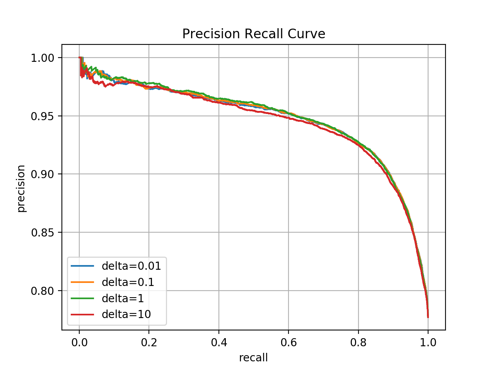

# Machine Problem 3

## Task 1: Feature Selection

### 1.1

Top 20 words selected by Information Gain
```
bland
delici
mediocr
perfect
n't
rude
bad
decent
amaz
disappoint
terribl
overpr
favorit
averag
worst
hype
expect
meh
love
horribl
```


Top 20 words selected by Chi Square

```
bland
mediocr
rude
bad
decent
delici
terribl
n't
overpr
worst
disappoint
averag
perfect
meh
hype
horribl
expect
amaz
poor
understand
```

The size of the finalized controlled vocabulary is `5000`.

`55516` review documents are there in the resulting corpus.

### 1.2

Implementation of Information Gain (The `Counter` is python's `collections.Counter`)

```python
def information_gain(reviews, words):
  # probs of positive / negative review
  l_counts = Counter([review.label for review in reviews])
  l_probs = {l: c / len(reviews) for l, c in l_counts.items()}

  entropy = lambda probs: sum([
    0 if p == 0 else p * math.log(p) for k, p in probs.items()
  ])

  words_ig = {}
  for word in words:
    w_reviews = [review for review in reviews if word in review.tokens]

    # probs of review with / without the word
    w_counts = {True: len(w_reviews), False: len(reviews) - len(w_reviews)}

    w_probs = {k: v / sum(w_counts.values()) for k, v in w_counts.items()}

    # probs of positive / negative review with the word
    l_w_counts = Counter([
      review.label for review in w_reviews
    ])

    l_w_probs = {k: v / sum(l_w_counts.values()) for k, v in l_w_counts.items()}

    # probs of positive / negative review without the word
    l_n_w_counts = {k: v - l_w_counts[k] for k, v in l_counts.items()}

    l_n_w_probs = {k: v / sum(l_n_w_counts.values()) for k, v in l_n_w_counts.items()}

    words_ig[word] = - entropy(l_probs) \
      + w_probs[True] * entropy(l_w_probs) \
      + w_probs[False] * entropy(l_n_w_probs)

  return words_ig
```

Implementation of Chi Square

```python
def chi_square(reviews, words):
  words_cs = {}
  pos_reviews = [review for review in reviews if review.label == 1]
  neg_reviews = [review for review in reviews if review.label == 0]

  for word in words:
    pos_counts = Counter(word in review.tokens for review in pos_reviews)
    neg_counts = Counter(word in review.tokens for review in neg_reviews)

    A = pos_counts[True]
    B = pos_counts[False]
    C = neg_counts[True]
    D = neg_counts[False]

    words_cs[word] = (A + B + C + D) * ((A * D - B * C) ** 2) \
      / ((A + C) * (B + D) * (A + B) * (C + D))

  return words_cs
```

## Task 2: Naive Bayes

### 2.1 Training Naive Bayes with Maximum a Posterior estimator

Top 20 words of ranked log-ratio list

```
gluttoni
ryan
fantasi
mmmmmmm
seamless
yummo
boutiqu
hoagi
underr
lambrusco
devin
yummmm
maxim
hand-cut
lickin
st.loui
ganach
slow-cook
dawn
mmmmmmmmm
```


Top 20 words of ranked log-ratio list

```
tablespoon
abysm
unappet
overr
flavorless
uninspir
over-r
2/5
a-ok
unaccept
incompet
downhil
unhelp
inexcus
tasteless
ined
roach
ick
blatant
rudest
```

In my opinion, many of them are neutral and do not make any sense in distinguishing the positive and negative sentiments, such as `st.loui`. It may be because the smooth parameter `delta=0.1` is too small which leads to extreme large/small log ratio of some rare words with accidental unbalanced distribution in the data.

### 2.2 Naive Bayes as a linear classifier

#### 2.2.1

Precision-Recall curve with default `delta=0.1`


#### 2.2.2

Precision-Recall curve with `delta=[0.01
0.1, 1, 10]`



By changing the smoothing paramter `delta`, the Precision-Recall curve tradeoff changes as well. This is because different `delta` lead to different language model probabilities which further impact the `f(x)` values of the testing corpus. Therefore, for a fixed number of true psotive predictions which is the same as a fixed recall value, models with different `delta` needs to make a different psotive/negative cut which means different precision.

## Task 3: k Nearest Neighbor

### 3.1

Implementation of random projection, which relies on `numpy` and returns the hash bits as an integer. The function `init_hash_vectors` is called after retrieved vector dimension size during `fit`.

```python
class KNN:
  def __init__(self, n_hashbits, n_neighbors):
    self.n_hashbits = n_hashbits
    self.n_neighbors = n_neighbors

    self.hash_vectors = None
    self.buckets = None

  def init_hash_vectors(self, dimensions):
    self.hash_vectors = np.random.uniform(-1, 1, (self.n_hashbits, dimensions))

  def project(self, vector):
    hash_bits = self.hash_vectors.dot(vector)
    hash_bits = [sgn(b) for b in hash_bits]
    hash_bits = ''.join(str(b) for b in hash_bits)

    return int(hash_bits, 2)

  def fit(self, vectors, labels):
    # vectors should have same dimension size
    self.init_hash_vectors(len(vectors[0]))

    ...
```
### 3.2

The running time of prediction of 5 query

Model | Time (seconds)
-|-
KNN Brute Force | 5.7899
KNN with 5 bits random projection | 0.2182

The approximate KNN can still determine the cusine of some query reviews

Query | Cusine
-|-
1 | Unknown
2 | Italian
3 | Mexican
4 | Japanese
5 | Unknown

However, in my opinion, determining the cuisine type cannot necessarily evaluate if the KNN results are reasonable. Because by far, the features / words have already been filtered based on how good they can distinguish the review sentiments. Based on this purpose, the "reasonable" nearest neighbours should be reviews with the same sentiment, not the same cuisine type.

On the other hand, the features are also not optimal to classify the cuisine, but the model indeed can still detect some review cuisines. It is because the vocabulary size is large enough to include not only the best sentiment sensitive words but also others accidentally helpful to tell the cuisine. For example, words like "peach" and "tuna" which are obviously sentiment neutral are left in the features set.

## Task 4: Classification performance evaluation

### 4.1

10-fold cross validation

Model | Avg Precision | Avg Recall | Avg F1
-|-|-|-
Naive Bayes | 0.9014 | 0.9042 | 0.9028
KNN | 0.8048 | 0.9574 | 0.8745

### 4.2

Followings are the results of the paired two sample t-test

Prcesion

Fold | Naive Bayes | KNN | Diff
-|-|-|-
1 | 0.9060 | 0.8126 | 0.0933
2 | 0.8949 | 0.8002 | 0.0947
3 | 0.9023 | 0.8019 | 0.1003
4 | 0.8894 | 0.7980 | 0.0914
5 | 0.9083 | 0.8125 | 0.0957
6 | 0.8997 | 0.8096 | 0.0901
7 | 0.9029 | 0.8035 | 0.0994
8 | 0.9088 | 0.8101 | 0.0986
9 | 0.9029 | 0.8027 | 0.1002
10 | 0.8981 | 0.7966 | 0.1014

precision t-value: 75.5697


Recall

Fold | Naive Bayes | KNN | Diff
-|-|-|-
1 | 0.9047 | 0.9515 | -0.0468
2 | 0.9059 | 0.9608 | -0.0549
3 | 0.9114 | 0.9607 | -0.0493
4 | 0.8996 | 0.9592 | -0.0595
5 | 0.9043 | 0.9570 | -0.0526
6 | 0.8993 | 0.9621 | -0.0627
7 | 0.8978 | 0.9530 | -0.0551
8 | 0.9132 | 0.9563 | -0.0430
9 | 0.9006 | 0.9559 | -0.0552
10 | 0.9046 | 0.9575 | -0.0528

recall t-value: -29.0127


F1

Fold | Naive Bayes | KNN | Diff
-|-|-|-
1 | 0.9053 | 0.8766 | 0.0287
2 | 0.9004 | 0.8732 | 0.0271
3 | 0.9068 | 0.8741 | 0.0326
4 | 0.8945 | 0.8712 | 0.0233
5 | 0.9063 | 0.8789 | 0.0273
6 | 0.8995 | 0.8793 | 0.0202
7 | 0.9003 | 0.8718 | 0.0284
8 | 0.9110 | 0.8772 | 0.0338
9 | 0.9017 | 0.8726 | 0.0291
10 | 0.9014 | 0.8697 | 0.0316

f1 t-value: 21.5893

To align with the two-tailed confidence level of 95%, the t-value should satisfy: -2.62 < t < 2.262, which is obviously not the case here for all metrics. For precision, Naive Bayes is significantly better. For recall, KNN is significantly better. For overall F1, Naive Bayes is significantly better. This should be due to the unbalanced dataset which has much more positive data. Because the KNN here does not apply weighted vote, the frequent positive samples dominate the vote and lead to more positive predictions. Therefore, KNN has a better recall but worse precision.

## Task 5: Explore the best configuration of l and k

The experiement is tested by choosing the length of projection hash code `l` from the set `[10, 9，8]` and the number of nearest neighbors `k` from the set `[1, 3, 5, 7]`. For each `k` and `l` combination, I do a 5-folds cross-validation with the corpus and evaluate its mean precision, mean recall, and mean f1.

Because of the time limit, the testing `l` set skips smaller numbers. Less hash bits equals to less buckets and more look-up instances which can dramatically ballon the running time under cross-validation. However, I believe smaller `l` should give better performance because the nearest neighbours can be chosen from a larger pool with less approximation. The testing `k` set consists of only odd numbers to avoid even votes.

l | k | precision | recall | f1
-|-|-|-|-
10 | 1 | 0.8196 | 0.8447 | 0.8320
10 | 3 | 0.7983 | 0.8952 | 0.8440
10 | 5 | 0.7938 | 0.9329 | 0.8578
10 | 7 | 0.7891 | 0.9502 | 0.8622
9 | 1 | 0.8217 | 0.8547 | 0.8379
9 | 3 | 0.8011 | 0.9011 | 0.8481
9 | 7 | 0.7913 | 0.9543 | 0.8652
9 | 5 | 0.7962 | 0.9407 | 0.8624
8 | 1 | 0.8231 | 0.8575 | 0.8399
8 | 3 | 0.8025 | 0.9073 | 0.8517
8 | 7 | 0.7943 | 0.9601 | 0.8694
8 | 5 | 0.7989 | 0.9417 | 0.8644

According to my setting, the optimal hyperparameters are `l=8` and `k=7`, which gives the best f1.
