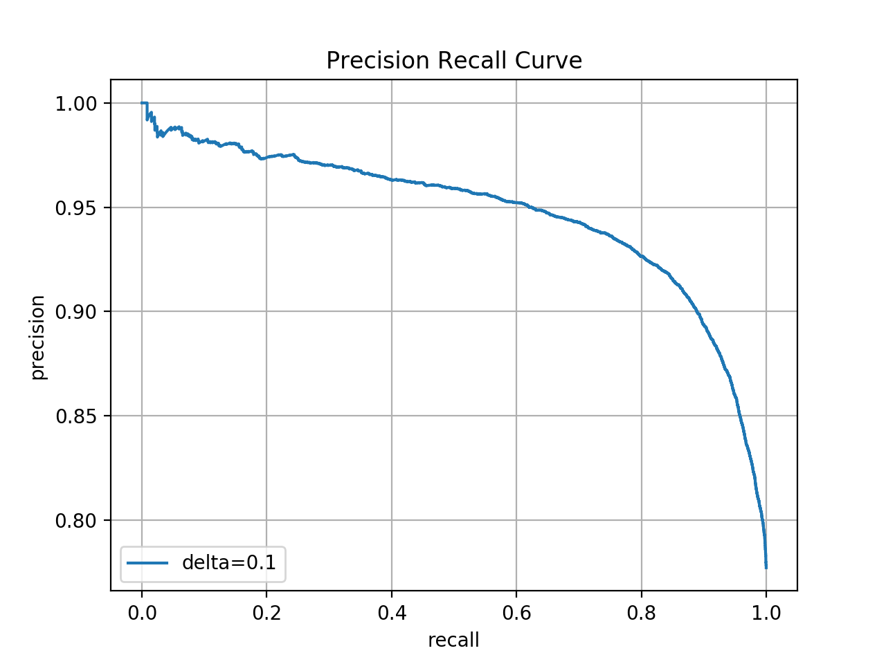

# Machine Problem 3

## Task 1: Feature Selection

### 1.1

Top 20 words selected by Information Gain
```
bland
delici
mediocr
n't
perfect
decent
rude
bad
amaz
terribl
favorit
disappoint
worst
averag
overpr
hype
meh
love
expect
horribl
```

Top 20 words selected by Chi Square

```
bland
mediocr
rude
decent
bad
n't
delici
terribl
worst
averag
overpr
disappoint
meh
perfect
hype
amaz
horribl
overr
lack
poor
```

The size of the finalized controlled vocabulary is `5000`.

`55268` review documents are there in the resulting corpus.

### 1.2

Implementation of Information Gain (The `Counter` is python's `collections.Counter`)

```python
def information_gain(reviews, words):
  # probs of positive / negative review
  l_counts = Counter([review.label for review in reviews])
  l_probs = {l: c / len(reviews) for l, c in l_counts.items()}

  entropy = lambda probs: sum([
    0 if p == 0 else p * math.log(p) for k, p in probs.items()
  ])

  words_ig = {}
  for word in words:
    w_reviews = [review for review in reviews if word in review.tokens]

    # probs of review with / without the word
    w_counts = {True: len(w_reviews), False: len(reviews) - len(w_reviews)}

    w_probs = {k: v / sum(w_counts.values()) for k, v in w_counts.items()}

    # probs of positive / negative review with the word
    l_w_counts = Counter([
      review.label for review in w_reviews
    ])

    l_w_probs = {k: v / sum(l_w_counts.values()) for k, v in l_w_counts.items()}

    # probs of positive / negative review without the word
    l_n_w_counts = {k: v - l_w_counts[k] for k, v in l_counts.items()}

    l_n_w_probs = {k: v / sum(l_n_w_counts.values()) for k, v in l_n_w_counts.items()}

    words_ig[word] = - entropy(l_probs) \
      + w_probs[True] * entropy(l_w_probs) \
      + w_probs[False] * entropy(l_n_w_probs)

  return words_ig
```

Implementation of Chi Square

```python
def chi_square(reviews, words):
  words_cs = {}
  pos_reviews = [review for review in reviews if review.label == 1]
  neg_reviews = [review for review in reviews if review.label == 0]

  for word in words:
    pos_counts = Counter(word in review.tokens for review in pos_reviews)
    neg_counts = Counter(word in review.tokens for review in neg_reviews)

    A = pos_counts[True]
    B = pos_counts[False]
    C = neg_counts[True]
    D = neg_counts[False]

    words_cs[word] = (A + B + C + D) * ((A * D - B * C) ** 2) \
      / ((A + C) * (B + D) * (A + B) * (C + D))

  return words_cs
```

## Task 2: Naive Bayes

### 2.1 Training Naive Bayes with Maximum a Posterior estimator

Top 20 words of ranked log-ratio list

```
gluttoni
ryan
mmmmmmm
fantasi
seamless
yummo
boutiqu
hoagi
underr
devin
maxim
meticul
hand-cut
yummmm
lambrusco
slow-cook
lickin
ganach
st.loui
tapioca
```

Top 20 words of ranked log-ratio list

```
off-night
downhil
unhelp
tasteless
nauseous
inexcus
ick
ined
blatant
deplor
wade
indigest
diarrhea
a-hol
emperor
ineffici
injuri
scam
rudest
2-star
```

In my opinion, many of them do not make any sense in distinguishing the positive opinion and negative opinion. It may be because the smooth parameter `delta=0.1` is too small which leads to extreme large/small log ratio of some rare words with accidental unbalanced distribution in the data.

### 2.2 Naive Bayes as a linear classifier

#### 2.2.1

Precision-Recall curve with default `delta=0.1`



#### 2.2.2

Precision-Recall curve with `delta=[0.01, 0.1, 1, 10]`


By changing the smoothing paramter `delta`, the Precision-Recall curve tradeoff changes as well. This is because different `delta` lead to different language model probabilities which further impact the `f(x)` values of the testing corpus. Therefore, for a fixed number of true psotive predictions which is the same as a fixed recall value, models with different `delta` needs to make a different psotive/negative cut which means different precision.

## Task 3: k Nearest Neighbor

### 3.1

Implementation of random projection, which relies on `numpy` and returns the hash bits as an integer. The function `init_hash_vectors` is called after retrieved vector dimension size during `fit`.

```python
class KNN:
  def __init__(self, n_hashbits, n_neighbors):
    self.n_hashbits = n_hashbits
    self.n_neighbors = n_neighbors

    self.hash_vectors = None
    self.buckets = None

  def init_hash_vectors(self, dimensions):
    self.hash_vectors = np.random.uniform(-1, 1, (self.n_hashbits, dimensions))

  def project(self, vector):
    hash_bits = self.hash_vectors.dot(vector)
    hash_bits = [sgn(b) for b in hash_bits]
    hash_bits = ''.join(str(b) for b in hash_bits)

    return int(hash_bits, 2)

  def fit(self, vectors, labels):
    # vectors should have same dimension size
    self.init_hash_vectors(len(vectors[0]))

    ...
```
### 3.2

The running time of prediction of 5 query

Model | Time (seconds)
-|-
KNN Brute Force | 4.7720
KNN with 5 bits random projection | 0.1535

The approximate KNN can still determine the cusine of some query reviews

Query | Cusine
-|-
1 | Unknown
2 | Italian
3 | Mexican
4 | Japanese
5 | Peach Cobbler

However, in my opinion, determining the cuisine type cannot necessarily evaluate if the KNN results are reasonable. Because by far, the features / words have already been filtered based on how good they can distinguish the review sentiments. Based on this purpose, the "reasonable" nearest neighbours should be reviews with the same sentiment, not the same cuisine type.

On the other hand, the features are also not optimal to classify the cuisine, but the model indeed can still detect some review cuisines. It is because the vocabulary size is large enough to include not only the best sentiment sensitive words but also others accidentally helpful to tell the cuisine. For example, words like "peach" and "tuna" which are obviously sentiment neutral are left in the features set.
